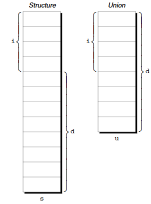

# structures, unions, enumerations

* 3 new types: structures, unions, enumerations
    * structure is collection of values (members), possibly of different types
    * union similar to structure, except members share same storage and can store one member at a time, but not all members simultaneously
    * enumeration is integer type whose values are named by programmer
* structs the most important by far

## structs

* array is a data structure
    * all elements of array have same type
    * to select array element, specify position as integer subscript
* structure properties:
    * elements (members) not required to have same type
    * members of structure have names, so to select member, specify name, not position

### declaring structure variables

* structure makes sense for storing a collection of related data items
* ```C
    struct {
        int number;
        char name[NAME_LEN + 1];
        int on_hand;
    } part1, part2;
    ```
    * this structure holds 3 members: number, name, and on_hand
    * struct {...} specifies a type
    * part1 and part2 are variables of this struct type
    * members of structure stored sequentially in memory in the order in which they're declared, so 4 bytes for number, however many bytes for the string, and 4 bytes for the int
* each structure represents new scope, so names declared in that scope won't conflict with other names in program
    * (separate name space for each structure)

### initializing structure variables

* struct variable can be initialized at declaration time
    * ```C
        struct {
            int number;
            char name[NAME_LEN + 1];
            int on_hand;
        } part1 = {528, "Disk drive", 10},
          part2 = {914, "Printer cable", 5};
        ```
* values in initializer must appear in same order as members of structure
    * similar to array initializer rules
    * expressions used must be constant (not necessarily in C99)
    * can have fewer members than structure it's initializing, leftover members given placeholder values of 0

### designated initializers

* `{528, "Disk drive", 10}` can also be written as `{.number = 528, .name = "Disk drive", .on_hand = 10}`
    * combination of period and member name is called designator
    * helps with making sure all members get the correct value
    * also doesn't have to be in order, so order of members can be changed in the future without affecting designated initializers
* not all values listed in designated initializer need to be prefixed
    * `{.number = 528, "Disk drive", .on_hand = 10}`
    * the string is assumed to initialize the member after number
    * any unaccounted members given value 0

### operations on structures

* selecting a member is done through name, not position
    * name of structure, then period, then member name
    * ```C
        printf("Part number: %d\n", part1.number);
        printf("Part name: %s\n", part1.name);
        printf("Quantity on hand: %d\n", part1.on_hand);
        ```
* members of structure are also lvalues, so we can assign or increment/decrement them to change values
    * ```C
        part1.number = 258;
        part1.on_hand++;
        ```
    * the period operator has same precedence as postfix ++ and --, so it takes precedence over nearly all operators
    * `&part1.on_hand` gives the memory address of on_hand in part1
* assignment can copy each member
    * `part2 = part1;` actually copies things like arrays
    * very useful for creating dummy strucures containing things to be copied
    * ```C
        struct {int a[10];} a1, a2;
        a1 = a2; //legal as both are structures
        ```
* the = operator can only be used with structures of compatible types
    * structures declared using the same "structure tag" or the same type name are compatible
* no operations on entire structures so comparison can't use == or !=

## structure types

* we've only covered declaring structure variables, but not naming them
    * ```C
        struct {
            int number;
            char name[NAME_LEN + 1];
            int on_hand;
        } part1;

        struct {
            int number;
            char name[NAME_LEN + 1];
            int on_hand;
        } part2;
        ```
    * part1 and part2 are technically not compatible
* use structure tag or typedef to define type name

### declaring structure tag

* structure tag: name used to identify particular kind of structure
    * ```C
        struct part {
            int number;
            char name[NAME_LEN + 1];
            int on_hand;
        }; //terminates declaration with ;

        struct part part1, part2; //struct is necessary because part isn't type name
        ```
    * structure tags don't conflict with other names in program (although it's confusing)
* can combine structure tag with declaration
    * ```C
        struct part {
            int number;
            char name[NAME_LEN + 1];
            int on_hand;
        } part1, part2;
        ```
    * all structures declared to have type struct part are compatible with one another
    * ```C
        struct part part1 = {528, "Disk drive", 10};
        struct part part2;
        part2 = part1; //legal as both have same type
        ```

### defining structure type

* typedef for declaring type name
    * ```C
        typedef struct {
            int number;
            char name[NAME_LEN + 1];
            int on_hand;
        } Part;
        ```
    * type name has to come after the struct {...}
    * just use type `Part`, not `struct Part`
* structure tag mandatory when structure used in linked list

### structures as arguments and return values

* ```C
    void print_part(struct part p) {
        printf("Part number: %d\n", p.number);
        printf("Part name: %s\n", p.name);
        printf("Quantity on hand: %d\n", p.on_hand);
    }

    print_part(part1);
    ```
* ```C
    struct part build_part(int number, const char *name, int on_hand) {
        struct part p;
        p.number = number;
        strcpy(p.name, name);
        p.on_hand = on_hand;
        return p;
    }

    part1 = build_part(528, "Disk drive", 10);
    ```
* passing structure to funciton and returning structure from function requires making copy of all members in structure, leading to higher overhead
    * pass pointer to structure instead or return pointer to structure
* \<stdio.h\> defines type named FILE, typically structure
    * FILE structure stores information about state of open file and must be unique in program
    * functions in \<stdio.h\> that open file returns pointer to FILE structure, every function that performs operation on open file requires FILE pointer as argument
* initializing struct variable inside function is allowed due to automatic storage duration
    * ```C
        void f(struct part part1) {
            struct part part2 = part1;
            ...
        }
        ```
    * part2 is local to the function because it's not static

### c99 compound literals

* can use compound literals to pass to function
* `print_part((struct part) {528, "Disk drive", 10});`
    * this creates a part structure containing information, which is then passed to the function
* `part1 = (struct part) {528, "Disk drive", 10};`
    * assigns compound literal to variable
    * not a declaration containing initializer
* compound literals contain type name in parentheses, followed by values inside braces
    * type name can be preceded by struct, or typedef name
    * compound literals may fail to provide full initialization, defaults to 0 for uninitialized members

## nested arrays and structures

* structs and arrays can be combined without restriction
    * arrays can have structs as elements
    * structs can contain arrays and other structures

### nested structures

* ```C
    struct person_name {
        char first[FIRST_NAME_LEN + 1];
        char middle_initial;
        char last[LAST_NAME_LEN + 1];
    };
    ```
* this can then be used inside another structure
* ```C
    struct student {
        struct person_name name;
        int id, age;
        char sex;
    };
    ```
    * allows us to treat names as units of data
    * we can pass the structure name rather than the 3 components of a name
    * also allows easier copying

### arrays of structures

* arrays can contain structures, acting as a simple database
* `struct part inventory[100];` is like a database of 100 parts
    * you know how accessing works

### initializing array of structures

* same as initializing multidimensional array
* ```C  
    struct dialing_code {
        char *country;
        int code;
    };
    ```
    * reason why country is a pointer is because we don't want country to point to a string literal
* ```C
    const struct dialing_code country_codes[] =
    {
        {"Argentina", 54},
        {"Bangladesh", 880},
        {"Brazil", 55},
        {"Burma (Myanmar)", 95},
        {"China", 86},
        {"Colombia", 57},
        {"Congo, Dem. Rep. of", 243},
        {"Egypt", 20},
        {"Ethiopia", 251},
        {"France", 33},
        {"Germany", 49},
        {"India", 91},
        {"Indonesia", 62}, 
        {"Iran", 98},
        {"Italy", 39}, 
        {"Japan", 81},
        {"Mexico", 52}, 
        {"Nigeria", 234},
        {"Pakistan", 92}, 
        {"Philippines", 63},
        {"Poland", 48}, 
        {"Russia", 7},
        {"South Africa", 27}, 
        {"South Korea", 82},
        {"Spain", 34}, 
        {"Sudan", 249},
        {"Thailand", 66}, 
        {"Turkey", 90},
        {"Ukraine" 380}, 
        {"United Kingdom", 44},
        {"United States", 1}, 
        {"Vietnam", 84}
    };
    ```
    * c99 designated initializers allow item to have more than one designator
    * ```C
        struct part inventory[100] = {
            [0].number = 528, [0].on_hand = 10, [0].name[0] = '\0';
        }
        ```
    * selects array element 0 (part struct) and selects member within structure

### maintaining parts database

* operations supported:
    * add new part number, name, initial quantity on hand
        * error if part already in database or database full
    * given part number, print name of part and current quantity on hand
        * error if part number not in database
    * given part number, change quantity on hand
        * error if part number isn't in database
    * print table showing all info in database
        * displayed in order in which they were entered
    * terminate program execution
* codes supported:
    * i (insert)
    * s (search)
    * u (update)
    * p (print)
    * q (quit)
* limited size of database to 100 parts (inventory)
    * num_parts keeps track of currently stored parts
* program organization
    * inventory.c
    * readline.h
    * readline.c

## unions

* union consists of one or more members, can be of different types
    * but compiler only allocates enough space for the largest of the members, which overlay each other within this space
    * assigning new value to one member alters values of other members as well
* ```C
    union {
        int i;
        double d;
    } u;
    ```
* members of structures are stored at different addresses in memory, while members of unions are stored at same address
    * 
    * in a structure, members occupy different memory, while in a union, the members overlap (and have the same address)
* accessing is the same as in a struct
* unions are good for storing one member or another, not for storing both
    * changing what's in a union will mess with how we see it with a different type
* properties very similar to structs
    * declare union tags and union types in the same way we declare structure tags and types
    * can be copied using =, passed to functions, returned by functions
* c89 initialization?
    * ```C
        union {
            int i;
            double d;
        } u = {0};
        ```
* c99 rules
    * designated initializers work with unions as well to specify which member we're initializing
    * ```C
        union {
            int i;
            double d;
        } u = {.d = 10.0};
        ```

### applications of unions: using unions to save space

* unions used to save space ink structures
* example: structure containing info about item sold through gift catalog
    * catalog carries books, mugs, shirts
    * each item has stock number and price, and information depending on item type
        * books: title, author, number of pages
        * mugs: design
        * shirts: design, colors available, sizes available
* simple attempt for this structure:
    * ```C
        struct catalog_item {
            int stock_number;
            double price;
            int item_type;
            char title[TITLE_LEN + 1];
            char author[AUTHOR_LEN + 1];
            int num_pages;
            char design[DESIGN_LEN + 1];
            int colors;
            int sizes;
        };
        ```
    * item type stores value BOOK, MUG, or SHIRT
    * colors, sizes would store encoded combinations of colors and sizes
    * but this wastes space, since only some of the information is important to an item
* using unions:
    * ```C
        struct catalog_item {
            int stock_number;
            double price;
            int item_type;
            union {
                struct {
                    char title[TITLE_LEN + 1];
                    int num_pages;
                } book;
                struct {
                    char design[DESIGN_LEN + 1];
                } mug;
                struct {
                    char design[DESIGN_LEN + 1];
                    int colors;
                    int sizes;
                } shirt;
            } item;
        }
        ```
    * main problem with this is that accessing is awkward:
        * ```C
            printf("%s", c.item.book.title);
            ```
    * this union contains 3 structures: two of which start with design
        * if we change one's design, the other's design will also make be changed (and make sense)
        * normally not a good idea to access data through a different member, but here it's fine

### applications of unions: using unions to build mixed data structures

* unions allow us to create data structures that contain mixture of data of different types
    * i.e. array whose elements are mixture of int and double values
        * seems impossible since arrays store elements of one type
    * ```C
        typedef union {
            int i;
            double d;
        } Number;
        Number number_array[1000];
        ```
    * because this is an array of Numbers rather than ints or doubles, we can assign elements values of type int or double

### adding tag field of union

* unions have major problem: there's no easy way to tell which number of union was last changed, so there's no way to tell which member contains meaningful value
* i.e. function to tell what value Number has:
    * ```C
        void print_number(Number n) {
            if (n contains integer) {
                printf("%d", n.i);
            } else {
                printf("%g", n.d);
            }
        }
        ```
    * but no way to tell whether n contains integer or floating point number
* solution is to embed union within structure that includes "tag field" or "discriminant" which tells us what is stored
    * ```C
        #define INT_KIND 0
        #define DOUBLE_KIND 1

        typedef struct {
            int kind; //tag field
            union {
                int i;
                double d;
            } u;
        } Number;
        ```
    * Number contains kind and u, kind tells us what is actually stored
    * each time we assign value to u, we also change kind
    * ```C
        n.kind = INT_KIND;
        n.u.i = 82;

        void print_number(Number n) {
            if (n.kind == INT_KIND) {
                printf("%d", n.u.i);
            } else {
                printf("%g", n.u.d);
            }
        }
        ```

## enumerations

* sometimes we need values that have small set of meaningful values
    * like boolean vlaues which can only be true or false
    * or suits of a card which should only be "clubs", "diamonds", "hearts", or "spades"
    * we could store values like this as codes (ints), but this can get hard to read
    * we could also use macros to define a suit "type" and names for the suits which is better, but it may not be obvious that the macros are to be used for this type only
* enumerated type: type whose values are listed ("enumerated") by programmer, who creates name (enumeration constant) for each value
    * ```C
        enum {CLUBS, DIAMONDS, HEARTS, SPADES} s1, s2;
        ```
    * enumeration constants similar to preprocessing #define directive constants, but enumeration constants are subject to C's scope rules
        * if enum declared inside function, its constants won't be visible outside function

### enumeration tags and type names

* ```C
    typedef enum {CLUBS, DIAMONDS, HEARTS, SPADES} Suit;
    Suit s1, s2;
    ```
    * can be used in c89 to create basic boolean type, but not necessary in c99

### enums as integers

* C treats enum vars and constants as integers
    * default assigns 0, 1, 2 to constants in enum
    * i.e. CLUBS, DIAMONDS, HEARTS, SPADES assigned 0, 1, 2, 3 respectively
* can also set different values for enums
    * ```C
        enum suit {CLUBS = 1, DIAMONDS = 2, HEARTS = 3, SPADES = 4};
        ```
    * numbers can be arbitrary, in no particular order
    * two or more enumeration constants can have same value
    * when no value specified, its value is 1 gerater than value of previous constant
* since enum values are integers, we can mix with ordinary integers
    * can result in nonsensical values being stored

### using enums to declare "tag fields"

* enums are perfect for tag fields
* ```C
    typedef struct {
        enum {INT_KIND, DOUBLE_KIND} kind;
        union {
            int i;
            double d;
        } u;
    } Number;
    ```
    * this does away with macros, and now kind only has two possible values
    * used in the same way as the previous version of this

## q&a

* sizeof operator may return number greater than sizes of members combined together because compiler may leave gaps to align members
* such holes can be between members or after last member, so it won't be at the beginning
    * so, pointer to first member of structure is the same as a pointer to the entire structure (even though they won't have the same type)
* the == operator doesn't test whether two structures are equal because it would be inconsistent with language's philosophy
    * individually comparing structure members would also be inefficient
    * comparing bypes is better, but with holes, comparison may not work
    * overall, structure comparison is just difficult to make right
* structure can have both tag and typedef name
* to share structure type among several files, put declaration of structure tag or typedef in header file, then include header file whereever it's needed
* (c89) structures defined in different files are compatible if members have same names and appear in same order, with corresponding members have compatible types
    * c99 adds that both structure have same tag or neither has tag
* pointers to compound literal are fine (and usually it's faster for functions to accept pointers rather than the whole struct)
    * technically compound literals can also be changed (rare)
* values of enumerated type can also be used as subscripts